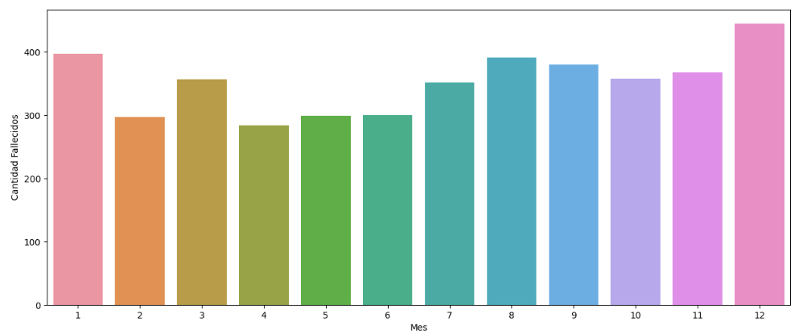
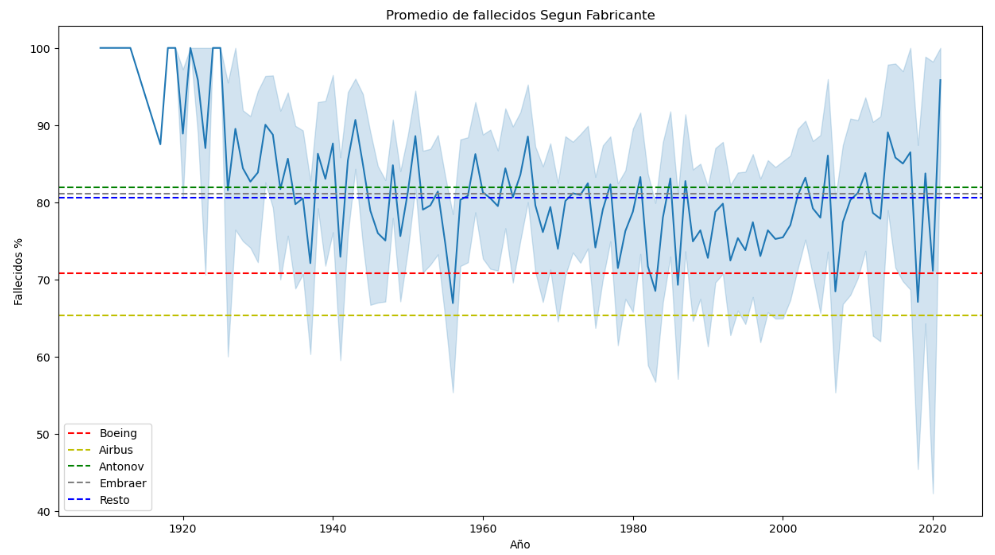
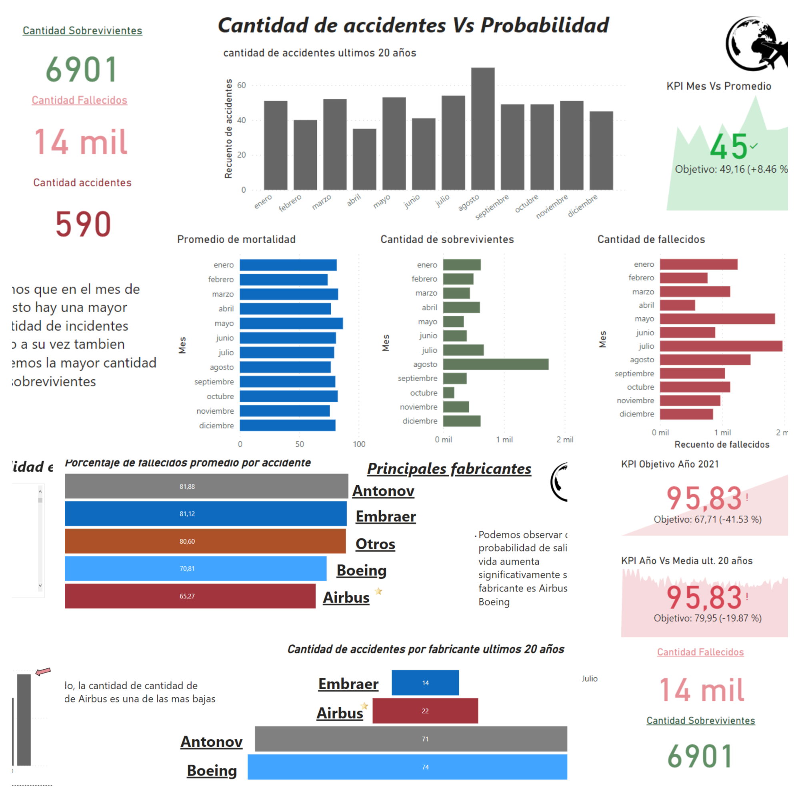

# Accidentes aéreos
Se realizó un trabajo en el que se tomó un archivo de datos en formato CSV y se llevó a cabo un análisis exploratorio de los mismos (EDA). Durante este análisis, se examinaron diversas características del conjunto de datos y se identificaron algunas tendencias y patrones relevantes. Posteriormente, se utilizó Power BI para crear una presentación visual que permitió exponer de manera más efectiva los patrones descubiertos durante el análisis exploratorio. El objetivo fue proporcionar una comprensión más clara y concisa de los datos a través de la visualización y presentación de los resultados.

## EDA
En el análisis exploratorio de datos (EDA), se realizaron diversas tareas para comprender y visualizar los conjuntos de datos. Se incluyeron estadísticas descriptivas para resumir las características principales de los datos. Además, Se buscaron patrones, outliers y anomalías que ayudaran a comprender mejor los datos.

---

## Patrones relevantes

 - ### Cantidad de accidente a lo largo del tiempo  
se pudo observar una interesante relación entre el crecimiento de la aviación y la cantidad de accidentes. Se identificó que a medida que la industria de la aviación crecía, también lo hacía la cantidad de accidentes, alcanzando su punto máximo en el año 1948. Sin embargo, a partir de ese momento, se pudo apreciar una disminución en la cantidad de accidentes, que se mantuvo en un rango relativamente estable durante cinco décadas.
Además, se destacó un descenso significativo en la cantidad de accidentes en los últimos 20 años.

 - ### Promedio de fallecidos a lo largo del tiempo  
Contrariamente a la cantidad de accidentes, se observa que el promedio de fallecidos ha disminuido a medida que la cantidad de accidentes ha aumentado. Este dato curioso muestra una relación inversa entre ambos aspectos, ya que ocurren prácticamente al mismo tiempo. Además, se destaca que a partir de la década de los años 50, el promedio de fallecidos se ha mantenido en niveles estables.

 - ### Cantidad de accidentes por mes 
En el análisis realizado, se observó que la cantidad de accidentes es mayor en el mes de diciembre. Sin embargo, es importante tener en cuenta que este dato debería contrastarse con otros estudios para confirmar su validez y determinar si existe alguna explicación o factor particular asociado a esta tendencia.

 - ### Promedio de fallecidos segun fabricante  
se identificó un dato muy interesante: existe una marcada diferencia en términos de probabilidad de sobrevivir a un accidente entre los principales fabricantes de aviones, como Boeing y Airbus, y el resto de los fabricantes. Los pasajeros que viajaban en aviones de Boeing y Airbus tenían una mayor probabilidad de sobrevivir en comparación con aquellos que viajaban en aviones fabricados por otras compañías.

---

## Dashboard

### El análisis exploratorio de datos se complementó con un dashboard creado en Power BI que incluyó varios KPI relevantes para medir el progreso hacia los objetivos y donde se presentaron visualmente los patrones y se mostraron más datos interesantes. Este dashboard proporciona información adicional que contribuye a un mejor entendimiento y toma de decisiones.

### En conclusión, el análisis exploratorio de datos reveló tendencias, relaciones y diferencias importantes, y el dashboard en Power BI amplió aún más el conjunto de datos interesantes y relevantes.

***

## Contribución

Si deseas contribuir al proyecto, por favor sigue estos pasos:

1. Haz un fork del repositorio. : https://github.com/rulomak/PI_Aviones.git
2. Crea una rama para tus cambios: `git checkout -b mi-rama`
3. Realiza los cambios necesarios y haz commit: `git commit -am "Descripción de los cambios"`
4. Realiza un push a la rama: `git push origin mi-rama`
5. Crea un pull request en GitHub.

## Autor

- Raul Abelleira